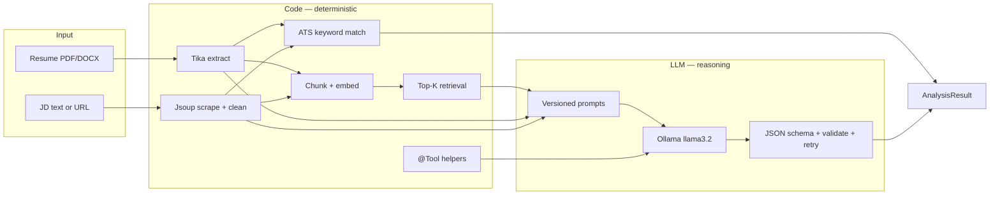

# Resume Analyzer

**Local-first Gen AI resume ↔ job matcher** built with Java 17, Spring Boot 3, Spring AI, and Ollama.

Upload a resume, paste a job description (or URL), and get a structured match report: score, skills gap, ATS keywords, and concrete rewrite suggestions — running entirely on your machine with **no cloud API keys**.

> Built as a 10-day hands-on Gen AI learning project. Designed so an interviewer can clone it, run it, and discuss real architecture choices — not just a chat-wrapper demo.

---

## 30-second pitch

| | |
|---|---|
| **Problem** | Job seekers need honest resume–JD fit feedback without leaking resumes to third-party APIs. |
| **Approach** | Hybrid pipeline: deterministic code (parse, scrape, ATS, RAG retrieval) + LLM reasoning (fit narrative, suggestions) with structured JSON + guardrails. |
| **Stack** | Spring Boot · Spring AI · Ollama (`llama3.2` + `nomic-embed-text`) · Jsoup · Tika · Thymeleaf · Docker Compose |
| **Proof** | Golden-dataset tests, versioned prompts, RAG citations in API, `@Tool` function calling, runnable UI + Compose. |

---

## Quick demo

**Prerequisites:** Java 17+, [Ollama](https://ollama.com)

```bash
ollama pull llama3.2
ollama pull nomic-embed-text
./mvnw spring-boot:run
```

| Surface | URL |
|---------|-----|
| **Web UI** | http://localhost:8081/ |
| **Swagger** | http://localhost:8081/swagger-ui.html |
| **Health** | http://localhost:8081/api/v1/health/ollama |

Or one command with Docker (app + Ollama + model pull):

```bash
docker compose up --build
```

---

## Architecture



**Hybrid rule of thumb used in this repo**

| Prefer code when… | Prefer LLM when… |
|-------------------|------------------|
| Fetching/parsing HTML, counting keywords, validating JSON shape | Scoring narrative fit, suggesting rewrites, normalizing fuzzy skill language |
| You need the same answer every time | You need judgment over ambiguous text |

---

## Features

- **Web UI** — upload resume, paste JD or job URL, loading state, session-cached resume
- **Analyze API** — structured match report + ATS lists + RAG citations
- **Analyze from URL** — scrape public job pages with Jsoup, then analyze
- **Resume review** — standalone critique without a JD
- **RAG** — chunk → embed (`nomic-embed-text`) → cosine top-K → prompt context + citations
- **Tools** — Spring AI `@Tool`: `extractSkills`, `scoreAtsKeywords`, `normalizeSkill`
- **Guardrails** — `BeanOutputConverter` schema, validation, one automatic retry; evidence filters drop hallucinated skills
- **Docker Compose** — `app` + `ollama` + one-shot model pull

### API

| Method | Endpoint | Purpose |
|--------|----------|---------|
| `GET` | `/` | Thymeleaf UI |
| `POST` | `/analyze-ui` | UI form → analysis |
| `GET` | `/api/v1/health/ollama` | Ollama + required models |
| `POST` | `/api/v1/analyze` | Resume vs JD (multipart; optional `useRag` / `useTools`) |
| `POST` | `/api/v1/analyze-from-url` | Resume vs job URL |
| `POST` | `/api/v1/resume/review` | Resume-only review |

---

## Gen AI concepts demonstrated

| Concept | Where it shows up |
|---------|-------------------|
| Prompt engineering | Versioned templates `analyze-v1.st` → `analyze-v2.st` (stricter guardrails, few-shot scoring bands) |
| Structured output | Spring AI `BeanOutputConverter` → `LlmAnalysisPayload` |
| Guardrails / anti-hallucination | Schema validation + retry; post-LLM evidence checks against resume text |
| RAG | `TextChunker` → embeddings → similarity search → citations on API result |
| Function calling | `AnalysisTools` registered on `ChatClient.tools(...)` |
| Hybrid AI | Scraper & ATS in Java; narrative & suggestions in the LLM |
| Local inference | Ollama — private, free, no API keys; slower than hosted frontier models |
| Evaluation | Golden samples under `src/test/resources/samples/` + score-band regression tests |
| Packaging | Thymeleaf UI + multi-stage Dockerfile + Compose |

---

## Evaluation (golden dataset)

Fixed fixtures in `src/test/resources/samples/`:

| Sample JD | Intent | Expected band |
|-----------|--------|---------------|
| `job-1.txt` | Java / Spring backend — **good match** | score **60–85**, keep Java in matched skills |
| `job-2.txt` | React / Node — **stack mismatch** | score **≤ 45**, drop hallucinated React/Node |
| `job-3.txt` | Senior data eng (Spark/Airflow) — **mismatch** | score **≤ 45**, drop hallucinated Spark |

Tests live in `AnalysisServiceTest` and related unit tests (`RagService`, `TextChunker`, tools, scraper, UI controller).

```bash
./mvnw test
```

---

## Design decisions & trade-offs

| Decision | Why | Trade-off |
|----------|-----|-----------|
| **Local Ollama** | Privacy, zero API cost, works offline | Slower & weaker than GPT-4-class APIs; tool-calling quality varies by model |
| **Hybrid pipeline** | Don’t ask the LLM to fetch HTML or count tokens | More moving parts than a single prompt |
| **Post-LLM evidence filter** | Small models invent skills | Can be stricter than a human recruiter |
| **In-memory RAG (per request)** | Simple, no vector DB ops burden | Re-embeds each request — fine for demo scale, not multi-tenant prod |
| **Session-cached resume in UI** | Avoid re-upload after each run | Browser file inputs can’t be restored; text is kept server-side for the session only |
| **URL scrape via Jsoup** | Real JD workflow | Login walls / heavy JS SPAs often fail — paste text fallback |

---

## Project structure

```
com.jaywant.resumeanalyzer
├── api/          REST controllers + exception handling
├── web/          Thymeleaf UI
├── domain/       AnalysisResult, Citation, LLM payloads
├── service/      Analysis, RAG, ATS, scrape, documents
├── ai/           Prompts, tools, structured output, validators
├── parser/       Truncation helpers
└── config/       App properties (RAG, scraper, tools, limits)

src/main/resources/prompts/   versioned prompt templates
src/test/resources/samples/   golden resume + JDs
docker-compose.yml            app + ollama
LEARNING_PLAN.md              day-by-day build journal
```

---

## Tech stack

- Java 17 · Spring Boot 3.4 · Spring AI 1.0 (Ollama)
- Apache Tika · Jsoup · Thymeleaf · springdoc OpenAPI
- Ollama models: `llama3.2` (chat), `nomic-embed-text` (embeddings)
- Maven Wrapper · Docker / Compose · JUnit 5 + Mockito

---

## Run details

### Local

```bash
./mvnw spring-boot:run
# Windows: .\mvnw.cmd spring-boot:run
```

App port: **8081** (see `application.yml`).

### Docker

```bash
docker compose up --build
```

| Service | Role |
|---------|------|
| `ollama` | LLM + embeddings on `11434` |
| `ollama-init` | Pulls required models once |
| `app` | Spring Boot on `8081` |

First run downloads models (several minutes). Stop with `docker compose down` (add `-v` to wipe model volume).

### Example curl

```bash
curl -X POST http://localhost:8081/api/v1/analyze \
  -F "resume=@/path/to/resume.pdf" \
  -F "jobDescription=We need a Java backend developer with Spring Boot, REST APIs, and SQL."
```

---

## Learning journal

This repo was built across a structured 10-day plan (prompting → structured output → eval → RAG → hybrid scrape → tools → UI/Docker → portfolio). See [`LEARNING_PLAN.md`](LEARNING_PLAN.md) for the day-by-day notes and glossary.

---

## License

MIT — see [`LICENSE`](LICENSE).
